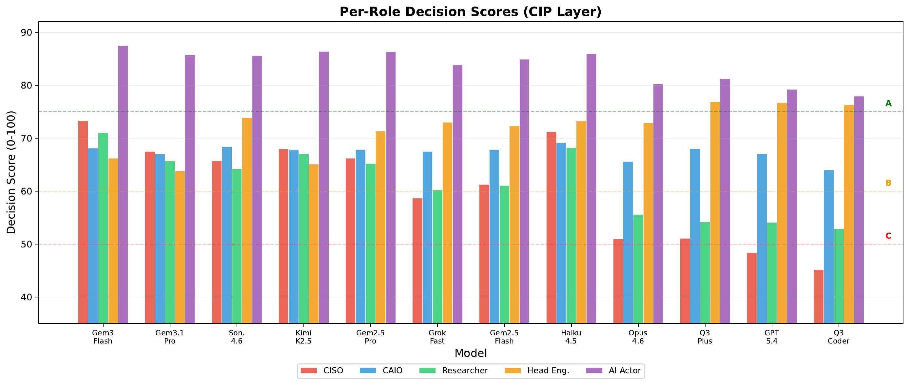
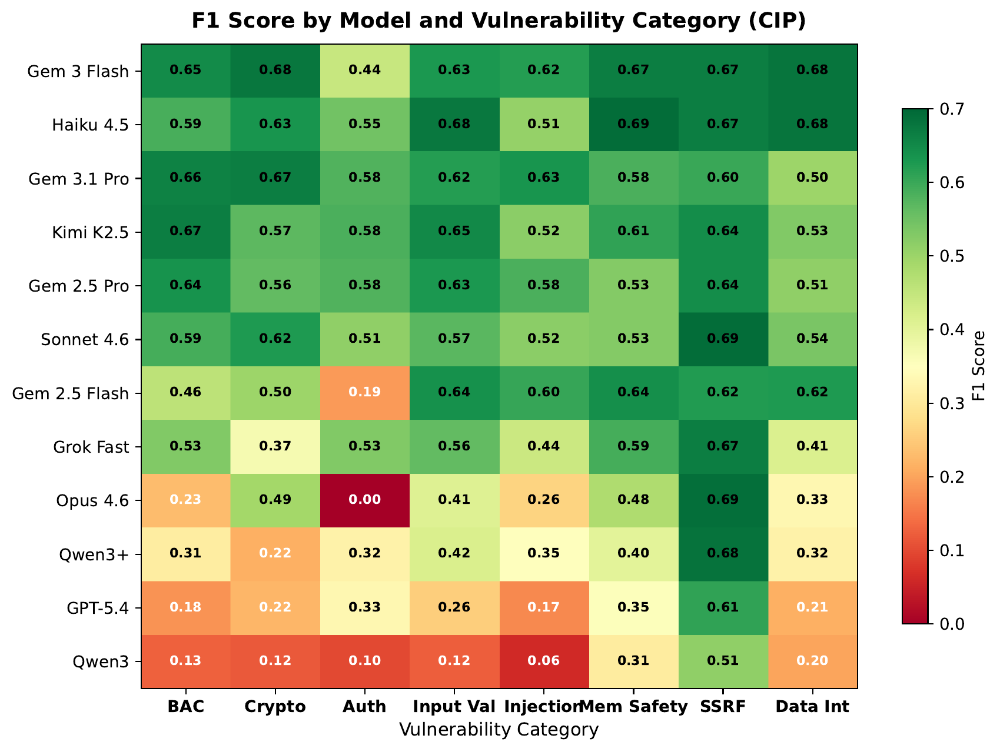
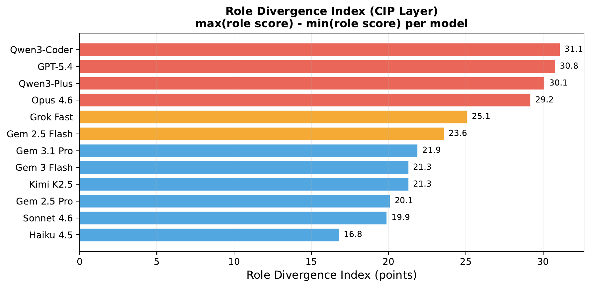
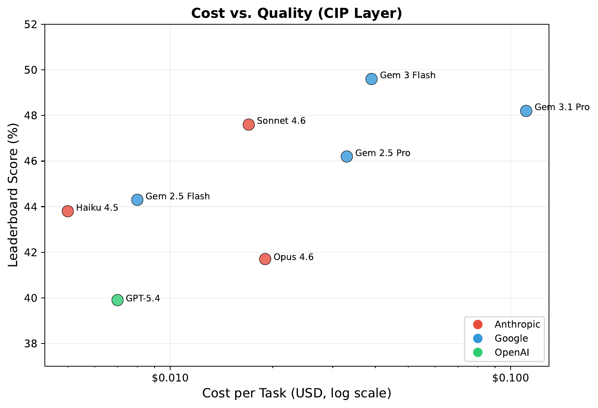
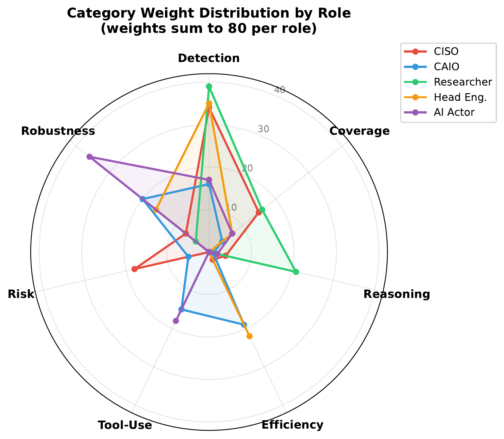
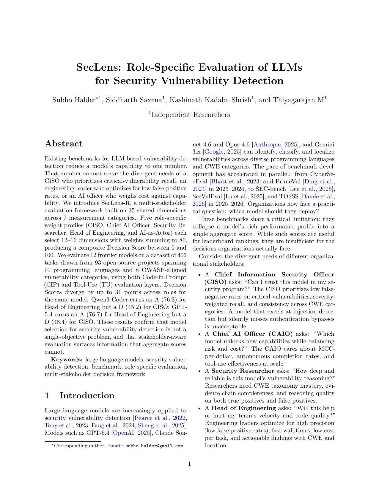

<p align="center">
  <h1 align="center">SecLens</h1>
  <p align="center">
    <strong>Role-Specific Evaluation of LLMs for Security Vulnerability Detection</strong>
  </p>
  <p align="center">
    <a href="paper/seclens_role_specific_evaluation.pdf">Paper</a> &middot;
    <a href="docs/overview.md">Docs</a> &middot;
    <a href="#quick-start">Quick Start</a> &middot;
    <a href="#results">Results</a>
  </p>
</p>

---

SecLens is a benchmark that evaluates LLMs on real-world vulnerability detection using confirmed CVEs from open-source projects. Unlike existing benchmarks that produce a single leaderboard score, SecLens scores each model through **five stakeholder lenses**, revealing that the best model depends on who is asking.

> **Key finding:** Decision Scores diverge by up to **31 points** for the same model. Qwen3-Coder earns an **A** for Head of Engineering but a **D** for CISO. Claude Haiku 4.5, ranked 8th on the leaderboard, scores **2nd** for CISO.

<p align="center">
  
</p>

## Why SecLens?

Existing security benchmarks (CyberSecEval, PrimeVul, SecVulEval) collapse a model's performance into one number. That number cannot answer:

| Stakeholder | Question | What they need |
|:---|:---|:---|
| **CISO** | Can I trust this model in my security program? | Severity-weighted recall, no blind spots |
| **Chief AI Officer** | Which model balances cost and capability? | MCC per dollar, autonomous completion |
| **Security Researcher** | Does the model understand vulnerability mechanics? | CWE accuracy, evidence chains |
| **Head of Engineering** | Will this help or hurt my team's velocity? | Precision, low cost, fast wall times |
| **AI as Actor** | Can this agent operate without supervision? | Parse reliability, graceful degradation |

SecLens answers all five questions from a single evaluation run.

## At a Glance

| | |
|:--|:--|
| **Tasks** | 406 CVE-grounded tasks from 93 open-source projects |
| **Languages** | Python, JavaScript, Go, Ruby, Rust, Java, PHP, C, C++, C# |
| **Categories** | 8 OWASP-aligned vulnerability categories |
| **Dimensions** | 35 shared metrics across 7 measurement categories |
| **Roles** | 5 stakeholder perspectives with distinct weight profiles |
| **Layers** | Code-in-Prompt (reasoning) + Tool-Use (real-world auditing) |
| **Models tested** | 12 frontier models from Anthropic, Google, OpenAI, and others |

## Results

### Role-Specific Decision Scores

The same 12 models, scored through 5 different lenses. Grade thresholds: A >= 75, B >= 60, C >= 50, D >= 40.

| Model | Leaderboard | CISO | CAIO | Researcher | Head Eng. | AI Actor |
|:---|:---:|:---:|:---:|:---:|:---:|:---:|
| Gemini 3 Flash Preview | 49.6% | B (73.3) | B (68.1) | B (71.0) | B (66.2) | A (87.5) |
| Gemini 3.1 Pro Preview | 48.2% | B (67.5) | B (67.0) | B (65.7) | B (63.8) | A (85.7) |
| Claude Sonnet 4.6 | 47.6% | B (65.7) | B (68.4) | B (64.2) | B (73.9) | A (85.6) |
| Kimi K2.5 | 46.8% | B (68.0) | B (67.8) | B (67.0) | B (65.1) | A (86.4) |
| Gemini 2.5 Pro | 46.2% | B (66.2) | B (67.9) | B (65.2) | B (71.3) | A (86.3) |
| Claude Haiku 4.5 | 43.8% | B (71.2) | B (69.1) | B (68.2) | B (73.3) | A (85.9) |
| Grok Code Fast 1 | 44.1% | C (58.7) | B (67.5) | B (60.2) | B (73.0) | A (83.8) |
| Gemini 2.5 Flash | 44.3% | B (61.3) | B (67.9) | B (61.1) | B (72.3) | A (84.9) |
| Claude Opus 4.6 | 41.7% | C (51.0) | B (65.6) | C (55.6) | B (72.9) | A (80.2) |
| Qwen3-Coder-Plus | 41.2% | C (51.1) | B (68.0) | C (54.2) | A (76.9) | A (81.2) |
| GPT-5.4 | 39.9% | D (48.4) | B (67.0) | C (54.1) | A (76.7) | A (79.2) |
| Qwen3-Coder | 37.3% | D (45.2) | B (64.0) | C (52.9) | A (76.3) | A (77.9) |

### Per-Category Vulnerability Detection

No single model dominates. Six different models lead at least one category.

<p align="center">
  
</p>

### Role Divergence

Models with conservative prediction strategies (high precision, low recall) earn top grades for Engineering but fail for CISO. The Role Divergence Index quantifies this gap.

<p align="center">
  
</p>

### Cost vs. Quality

Spending more does not guarantee better results. GPT-5.4 delivers the best MCC-per-dollar at $0.007/task.

<p align="center">
  
</p>

## Architecture

SecLens evaluates models in two layers, then scores through role-specific weight profiles:

```
                    ┌─────────────────────────────────┐
                    │     Dataset (406 CVE tasks)      │
                    └──────────┬──────────────────────┘
                               │
                 ┌─────────────┴─────────────┐
                 ▼                           ▼
    ┌────────────────────┐     ┌────────────────────────┐
    │  Layer 1: CIP      │     │  Layer 2: Tool-Use     │
    │  Code in prompt    │     │  read_file, search,    │
    │  Single-turn       │     │  list_dir (sandboxed)  │
    └────────┬───────────┘     └────────┬───────────────┘
             │                          │
             └──────────┬───────────────┘
                        ▼
            ┌───────────────────────┐
            │  35 Shared Dimensions │
            │  7 Categories         │
            └───────────┬───────────┘
                        │
        ┌───────┬───────┼───────┬───────┐
        ▼       ▼       ▼       ▼       ▼
     ┌──────┐┌──────┐┌──────┐┌──────┐┌──────┐
     │ CISO ││ CAIO ││ Res. ││ Eng. ││ AI   │
     │16 dim││14 dim││13 dim││13 dim││13 dim│
     │ Σ=80 ││ Σ=80 ││ Σ=80 ││ Σ=80 ││ Σ=80 │
     └──┬───┘└──┬───┘└──┬───┘└──┬───┘└──┬───┘
        ▼       ▼       ▼       ▼       ▼
     Score   Score   Score   Score   Score
     0-100   0-100   0-100   0-100   0-100
```

### Weight Profiles

Each role weights the 7 dimension categories differently:

<p align="center">
  
</p>

## Quick Start

```bash
# Install
uv venv --python 3.13
uv sync

# Set API key
export ANTHROPIC_API_KEY="sk-ant-..."

# Run evaluation (Code-in-Prompt layer)
seclens run -m "anthropic/claude-sonnet-4-20250514" -d dataset.jsonl

# Run evaluation (Tool-Use layer)
seclens run -m "anthropic/claude-sonnet-4-20250514" -d dataset.jsonl --layer tool-use

# View role-specific report
seclens report -r out/report_model.json --role ciso
seclens report -r out/report_model.json --all-roles

# Compare models across roles
seclens compare -r report_a.json -r report_b.json --all-roles
```

## Commands

| Command | Purpose |
|:---|:---|
| `seclens run` | Evaluate a model on CVE tasks |
| `seclens summary` | View aggregate metrics from a run |
| `seclens report --role <name>` | Generate role-specific analysis |
| `seclens report --all-roles` | Generate all 5 role reports |
| `seclens compare` | Compare models through role lenses |

## Scoring

Each vulnerability task is scored on three dimensions:

| Dimension | Points | What It Measures |
|:---|:---:|:---|
| **Verdict** | 1 | Correctly identifies if code is vulnerable |
| **CWE** | +1 | Identifies the correct vulnerability type (e.g., CWE-89) |
| **Location** | +1 | Pinpoints the vulnerable code (continuous IoU score) |

35 aggregate dimensions are computed from per-task results, normalized to [0, 1] using four strategies (ratio, MCC, lower-is-better, higher-is-better), and weighted per role to produce a **Decision Score** (0-100) with grades **A** through **F**.

| Grade | Score | Meaning |
|:---:|:---:|:---|
| **A** | >= 75 | Excellent for this role |
| **B** | >= 60 | Good; review weak dimensions |
| **C** | >= 50 | Fair; requires human oversight |
| **D** | >= 40 | Poor; significant gaps |
| **F** | < 40 | Not suitable for this role |

## 35 Dimensions Across 7 Categories

| Category | Dimensions | What It Covers |
|:---|:---|:---|
| **Detection** | D1-D8 | MCC, Recall, Precision, F1, TNR, CWE Accuracy, Location IoU, Actionable Finding Rate |
| **Coverage** | D9-D13 | CWE breadth, worst-category floor, cross-language consistency, SAST FP filtering |
| **Reasoning** | D14-D17 | Evidence completeness, reasoning presence, reasoning + correct verdict, FP reasoning |
| **Efficiency** | D18-D23 | Cost/task, cost/TP, MCC/$, wall time, throughput, tokens/task |
| **Tool-Use** | D24-D27 | Tool calls, turns, navigation efficiency, tool effectiveness |
| **Risk** | D28-D30 | Severity-weighted recall, critical miss rate, severity coverage |
| **Robustness** | D31-D35 | Parse success, format compliance, error rate, autonomous completion, graceful degradation |

## Dataset

| Property | Value |
|:---|:---|
| Total tasks | 406 (203 true positive + 203 post-patch) |
| Source projects | 93 open-source repositories |
| Languages | 10 (PHP, Go, Python, C#, Ruby, Java, C, Rust, JavaScript, C++) |
| Vulnerability categories | 8 OWASP-aligned |
| Severity levels | Critical (25), High (74), Medium (83), Low (21) |
| Task pairing | Each CVE has a vulnerable + patched version |

**Vulnerability Categories (OWASP Top 10:2021 aligned):**

| Category | Tasks | OWASP Mapping |
|:---|:---:|:---|
| Broken Access Control | 82 | A01:2021 |
| Cryptographic Failures | 64 | A02:2021 |
| Injection | 62 | A03:2021 |
| Improper Input Validation | 58 | Extended |
| Server-Side Request Forgery | 46 | A10:2021 |
| Authentication Failures | 38 | A07:2021 |
| Data Integrity Failures | 36 | A08:2021 |
| Memory Safety | 20 | Extended |

## Documentation

| Document | Description |
|:---|:---|
| [Overview](docs/overview.md) | What SecLens is and how it works |
| [Evaluation Layers](docs/evaluation-layers.md) | Code-in-Prompt vs Tool-Use |
| [Scoring](docs/scoring.md) | Per-task scoring, IoU, grading, confidence intervals |
| [Dimensions](docs/dimensions.md) | All 35 dimensions across 7 categories |
| [Roles](docs/roles.md) | 5 stakeholder perspectives and weight profiles |
| [Coverage](docs/coverage.md) | Vulnerability categories, languages, dataset design |
| [Usage Guide](docs/usage.md) | Configuration, CLI options, helper scripts |

## Paper

**SecLens: Role-Specific Evaluation of LLMs for Security Vulnerability Detection**
Subho Halder, Siddharth Saxena, Kashinath Kadaba Shrish, Thiyagarajan M

<p align="center">
  <a href="paper/seclens_role_specific_evaluation.pdf">
    
  </a>
</p>

<p align="center">
  <a href="paper/seclens_role_specific_evaluation.pdf">Read the full paper (PDF)</a>
</p>

## Development

```bash
# Setup
uv venv --python 3.13
uv sync --extra dev
cp .env.example .env  # fill in API keys

# Run tests
uv run pytest

# Lint
uv run ruff check .
```

## Project Structure

```
seclens/
  cli/          CLI commands (run, summary, report, compare)
  dataset/      HuggingFace and local JSONL loading
  evaluation/   Evaluation runner and orchestration
  parsing/      LLM response parsing (3-stage fallback)
  prompts/      Prompt templates (base, minimal, security_expert)
  roles/        35 dimensions, normalization, scoring, 5 YAML weight profiles
  sandbox/      Git clone sandboxing for Tool-Use layer
  schemas/      Pydantic models (tasks, output, scoring, reports)
  scoring/      Scoring logic, aggregation, bootstrap CIs, model reports
  results/      JSONL result I/O with thread safety
  worker/       Thread pool for parallel evaluation
paper/          Research paper (LaTeX source, PDF, figures)
assets/         README images
docs/           Documentation
```

## Sponsors

SecLens is sponsored by:

<table>
  <tr>
    <td align="center" width="50%">
      <a href="https://www.appknox.com">
        <strong>Appknox</strong>
      </a>
      <br>
      Mobile Application Security
    </td>
    <td align="center" width="50%">
      <a href="https://www.kalmantic.com">
        <strong>Kalmantic Labs</strong>
      </a>
      <br>
      AI Security Research
    </td>
  </tr>
</table>

## License

See [LICENSE](LICENSE) for details.

## Citation

If you use SecLens in your research, please cite:

```bibtex
@article{halder2026seclens,
  title={SecLens: Role-Specific Evaluation of LLMs for Security Vulnerability Detection},
  author={Halder, Subho and Saxena, Siddharth and Shrish, Kashinath Kadaba and M, Thiyagarajan},
  year={2026}
}
```
